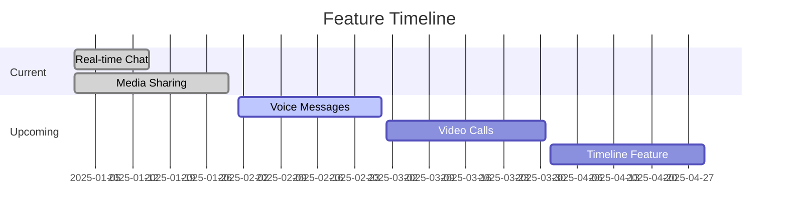

<div align="center">


# LoveRoom

> A next-generation private messaging platform built for meaningful connections

[](LICENSE)
[](https://reactjs.org/)
[](https://mui.com/)
[](https://github.com/scrollDynasty/love-room)

</div>

## ✨ Highlights

- 🔒 **End-to-End Encryption** - Your conversations stay private
- 🎨 **Modern UI/UX** - Clean, intuitive interface with dark mode support
- 📱 **Cross-Platform** - Seamless experience across all devices
- ⚡ **Real-Time** - Instant messaging and status updates
- 🖼️ **Rich Media** - Share images, videos, and more

## 🚀 Quick Start

```bash
# Get the latest source
git clone https://github.com/scrollDynasty/love-room.git

# Change into the project
cd love-room

# Install dependencies
npm install

# Launch development environment
npm start
```

## 🛠️ Tech Stack

<div align="center">

[](https://skillicons.dev)

</div>

| Technology | Purpose |
|------------|---------|
| React 18   | Frontend Framework |
| Redux Toolkit | State Management |
| Material-UI | UI Components |
| Socket.IO | Real-time Communication |
| SCSS | Styling |
| TypeScript | Type Safety |

## 🌟 Features

### Core Experience

- **Real-Time Chat**
  - Instant message delivery
  - Typing indicators
  - Read receipts
  - Rich text formatting

- **Media Sharing**
  - High-resolution images
  - Video sharing
  - Voice messages
  - File attachments

- **Privacy First**
  - End-to-end encryption
  - Two-factor authentication
  - Private spaces
  - Secure file storage

### Customization

- **Themes**
  - Dark/Light modes
  - Custom color schemes
  - Personalized layouts

- **Profile**
  - Custom avatars
  - Status messages
  - Shared profiles

## 📱 Interface

<div align="center">

| Light Mode | Dark Mode |
|------------|-----------|
|  |  |

</div>

## 🎯 Roadmap



## ⚙️ Installation

### Prerequisites

```bash
node >= 14.0.0
npm >= 6.14.0
```

### Development Setup

1. **Clone Repository**
   ```bash
   git clone https://github.com/scrollDynasty/love-room.git
   ```

2. **Install Dependencies**
   ```bash
   cd love-room
   npm install
   ```

3. **Configure Environment**
   ```bash
   cp .env.example .env
   ```

4. **Start Development Server**
   ```bash
   npm start
   ```

Visit `http://localhost:3000` to view the application.

## 🤝 Contributing

We welcome contributions! See our [Contributing Guide](CONTRIBUTING.md) for details.

```bash
# Create a branch
git checkout -b feature/amazing-feature

# Commit changes
git commit -m 'Add amazing feature'

# Push branch
git push origin feature/amazing-feature
```

## 📄 License

Released under the MIT License. See [LICENSE](LICENSE) for details.

## 📞 Support

- 📧 Email: scrolldynasty@gmail.com
- 🐛 Issues: [GitHub Issues](https://github.com/scrollDynasty/love-room/issues)
- 💬 Discussions: [GitHub Discussions](https://github.com/scrollDynasty/love-room/discussions)

---

<div align="center">

### Made with ❤️ by scrollDynasty

[Website](https://scrolldynasty.com) • [GitHub](https://github.com/scrollDynasty) • [Twitter](https://twitter.com/scrolldynasty)

</div>